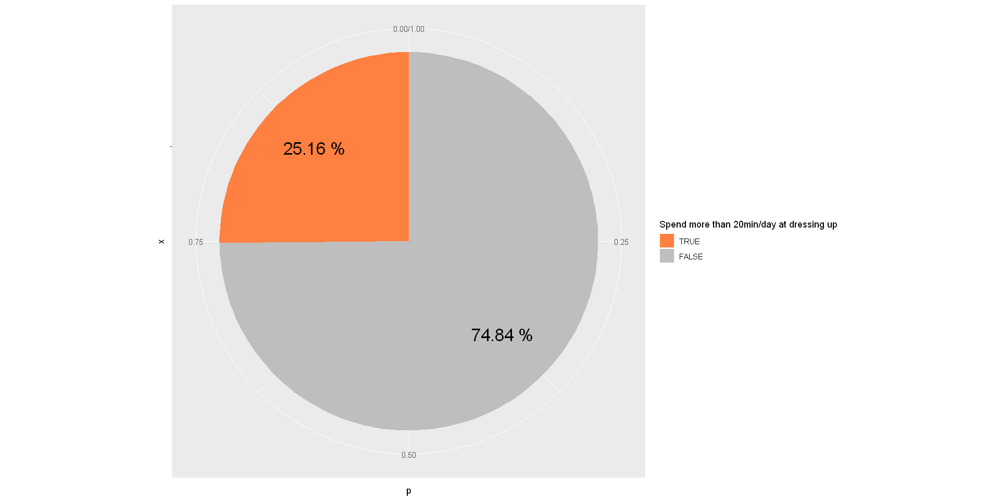
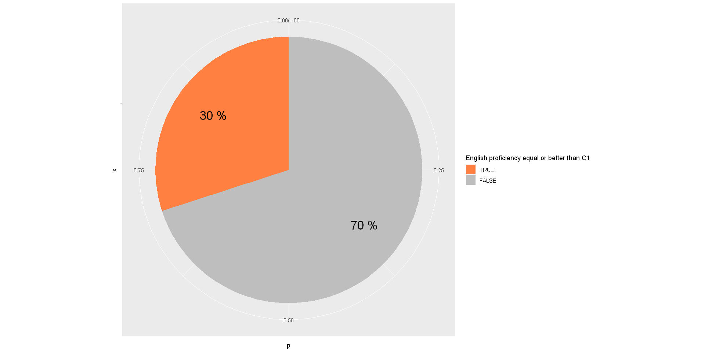
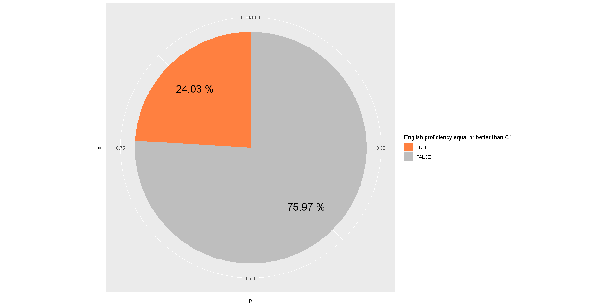
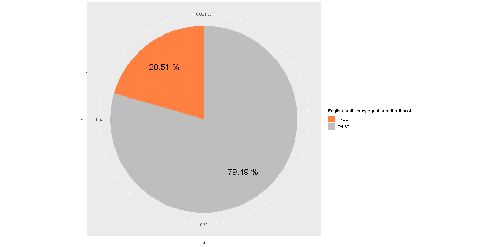
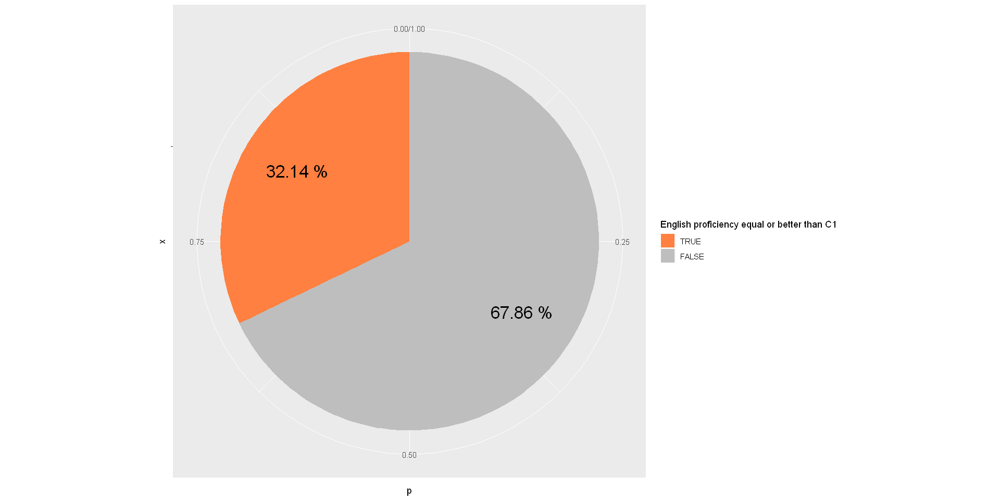
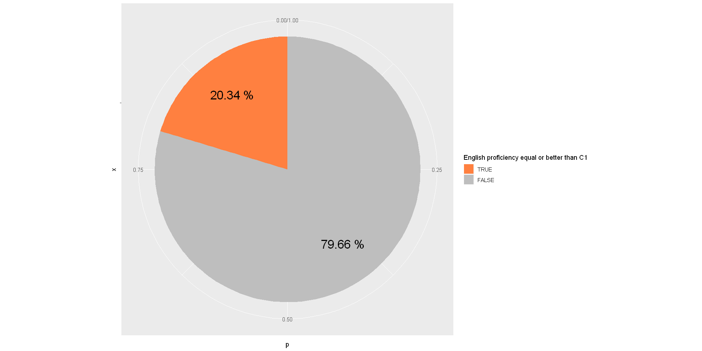
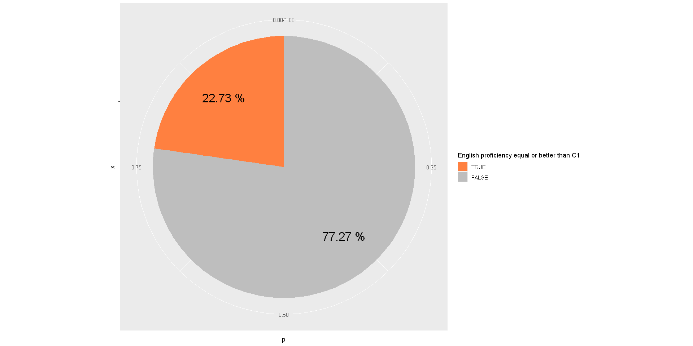
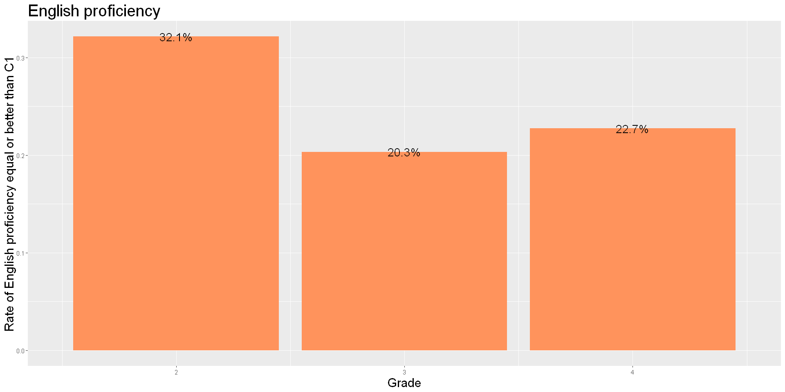
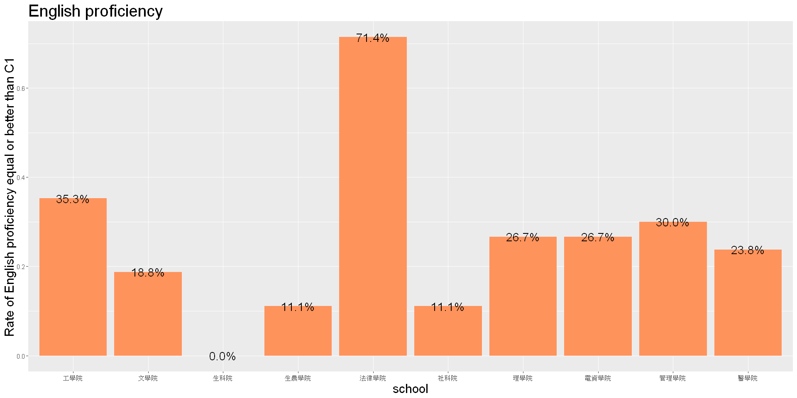

# 英文能力比例
註:英語能力的判定是藉由問卷調查曾通過的任意英檢項目的分數，並依以下方式做換算<br/>
http://www.ciall.nkfust.edu.tw/ezfiles/44/1044/img/800/206918726.pdf<br/>
若不曾參與過英語檢定，則忽略此筆觀測<br/>
共有15%的受試者不曾參與過英語檢定


```R
data <- read.csv("D:/JHow/Program/Statistic/elite.csv")
library(ggplot2)
library(dplyr)
library(tidyr)
str(data)
observing <- data
observing <- observing[complete.cases(observing),]
observing <- observing %>% mutate(Eng4up = EnglishProficiency >= 4) %>% group_by(Eng4up)
```

    'data.frame':	187 obs. of  21 variables:
     $ gender                        : int  2 2 1 2 1 2 1 1 1 2 ...
     $ grade                         : int  3 3 4 3 4 4 3 3 3 4 ...
     $ school                        : int  1 4 6 2 4 4 2 3 3 2 ...
     $ isCoM                         : int  0 0 0 0 0 0 0 0 0 0 ...
     $ hasMacBook                    : int  1 0 0 1 0 1 0 0 0 1 ...
     $ hasiPhone                     : int  1 1 1 0 0 1 0 0 1 1 ...
     $ hasSuit                       : int  0 1 0 1 0 1 1 0 1 0 ...
     $ timeToDressUp                 : int  45 35 15 5 5 5 25 15 25 15 ...
     $ cafePricePerWeek              : int  150 250 250 50 0 0 150 0 50 150 ...
     $ mealPricePerDay               : int  150 350 350 150 150 150 150 250 250 250 ...
     $ hasCreditCard                 : int  1 1 1 0 0 1 0 0 1 0 ...
     $ hasAttendedBusinessCompetition: int  0 0 0 0 0 0 1 0 1 0 ...
     $ EnglishProficiency            : int  4 4 3 NA 3 5 2 3 2 5 ...
     $ coursesInCoM                  : int  0 2 0 0 0 9 2 1 1 0 ...
     $ coursesInCoMPerYear           : num  0 0.667 0 0 0 ...
     $ GPA                           : num  3.7 3.92 3.2 3.33 4.29 2.4 3.6 3.9 3 3.4 ...
     $ exchangeAbroad                : int  0 1 0 0 0 0 0 0 0 0 ...
     $ numbersOfTravelingAbroad      : num  1.5 1.5 1.5 0 0 1.5 0 0 1.5 1.5 ...
     $ barPerMonth                   : int  0 2 0 0 0 0 0 0 0 0 ...
     $ club                          : int  7 1 3 2 7 7 2 2 5 5 ...
     $ interestInMentionedJob        : int  3 3 2 1 1 5 3 5 5 1 ...
    

## 整體樣本


```R
sample <- observing
sample %>% summarise(n = n(), p = n()/ nrow(sample)) %>% mutate(pos = cumsum(p)- p/2) %>% 
    ggplot(aes(x = "", y = p, fill = factor(Eng4up, levels = c(T, F)))) +
    geom_bar(width = 1, stat = "identity") + coord_polar("y", start=0) +
     scale_fill_manual(name = "English proficiency equal or better than C1",
                         values = c("#FF8040", "grey")) +
      geom_text(aes(x= 1.2, y=pos, label = paste(round(p, 4)*100, "%")), size=7)
```





## 管院學生


```R
sample <- observing %>% filter(school == 7)
sample %>% summarise(n = n(), p = n()/ nrow(sample)) %>% mutate(pos = cumsum(p)- p/2) %>% 
    ggplot(aes(x = "", y = p, fill = factor(Eng4up, levels = c(T, F)))) +
    geom_bar(width = 1, stat = "identity") + coord_polar("y", start=0) +
     scale_fill_manual(name = "English proficiency equal or better than C1",
                         values = c("#FF8040", "grey")) +
      geom_text(aes(x= 1.2, y=pos, label = paste(round(p, 4)*100, "%")), size=7)
```





## 非管院學生


```R
sample <- observing %>% filter(school != 7)
sample %>% summarise(n = n(), p = n()/ nrow(sample))  %>% mutate(pos = cumsum(p)- p/2) %>% 
    ggplot(aes(x = "", y = p, fill = factor(Eng4up, levels = c(T, F)))) +
    geom_bar(width = 1, stat = "identity") + coord_polar("y", start=0) +
     scale_fill_manual(name = "English proficiency equal or better than C1",
                         values = c("#FF8040", "grey")) +
      geom_text(aes(x= 1.2, y=pos, label = paste(round(p, 4)*100, "%")), size=7)
```





## 男性


```R
sample <- observing %>% filter(gender == 1)
sample %>% summarise(n = n(), p = n()/ nrow(sample))  %>% mutate(pos = cumsum(p)- p/2) %>% 
    ggplot(aes(x = "", y = p, fill = factor(Eng4up, levels = c(T, F)))) +
    geom_bar(width = 1, stat = "identity") + coord_polar("y", start=0) +
     scale_fill_manual(name = "English proficiency equal or better than C1",
                         values = c("#FF8040", "grey")) +
      geom_text(aes(x= 1.2, y=pos, label = paste(round(p, 4)*100, "%")), size=7)
```





## 女性


```R
sample <- observing %>% filter(gender == 2)
sample %>% summarise(n = n(), p = n()/ nrow(sample))  %>% mutate(pos = cumsum(p)- p/2) %>% 
    ggplot(aes(x = "", y = p, fill = factor(Eng4up, levels = c(T, F)))) +
    geom_bar(width = 1, stat = "identity") + coord_polar("y", start=0) +
     scale_fill_manual(name = "English proficiency equal or better than C1",
                         values = c("#FF8040", "grey")) +
      geom_text(aes(x= 1.2, y=pos, label = paste(round(p, 4)*100, "%")), size=7)
```


### 小結
由樣本可以初步觀察到，<br/>
女性英文能力在4(C1)以上的比率較男性來的高<br/>
得到初步結論女性在英語能力上表現優異者可能較男性高<br/>

## 大二學生


```R
sample <- observing %>% filter(grade == 2)
sample %>% summarise(n = n(), p = n()/ nrow(sample)) %>% mutate(pos = cumsum(p)- p/2) %>% 
    ggplot(aes(x = "", y = p, fill = factor(Eng4up, levels = c(T, F)))) +
    geom_bar(width = 1, stat = "identity") + coord_polar("y", start=0) +
     scale_fill_manual(name = "English proficiency equal or better than C1",
                         values = c("#FF8040", "grey")) +
      geom_text(aes(x= 1.2, y=pos, label = paste(round(p, 4)*100, "%")), size=7)
```





## 大三學生


```R
sample <- observing %>% filter(grade == 3)
sample %>% summarise(n = n(), p = n()/ nrow(sample)) %>% mutate(pos = cumsum(p)- p/2) %>% 
    ggplot(aes(x = "", y = p, fill = factor(Eng4up, levels = c(T, F)))) +
    geom_bar(width = 1, stat = "identity") + coord_polar("y", start=0) +
     scale_fill_manual(name = "English proficiency equal or better than C1",
                         values = c("#FF8040", "grey")) +
      geom_text(aes(x= 1.2, y=pos, label = paste(round(p, 4)*100, "%")), size=7)
```





## 大四學生


```R
sample <- observing %>% filter(grade == 4)
sample %>% summarise(n = n(), p = n()/ nrow(sample)) %>% mutate(pos = cumsum(p)- p/2) %>% 
    ggplot(aes(x = "", y = p, fill = factor(Eng4up, levels = c(T, F)))) +
    geom_bar(width = 1, stat = "identity") + coord_polar("y", start=0) +
     scale_fill_manual(name = "English proficiency equal or better than C1",
                         values = c("#FF8040", "grey")) +
      geom_text(aes(x= 1.2, y=pos, label = paste(round(p, 4)*100, "%")), size=7)
```





## 按年級比較


```R
options(repr.plot.width=8, repr.plot.height=8)
observing %>% group_by(grade) %>% summarise(Eng4up = sum(Eng4up) ,total = n()) %>% mutate(p = Eng4up / total) %>%
    ggplot(aes(x = grade, y = p)) + geom_col(fill = "#FF935C") +
    geom_text(aes( label = scales::percent(p),
                   y= p ), stat= "identity", position = position_dodge(1), size = 6) +
    labs(x = "Grade", y = "Rate of English proficiency equal or better than C1", title = "English proficiency") +
    theme(plot.title = element_text(size = 24),
          axis.title = element_text(size = 18))
```





### 小結
相比之下在樣本之中<br/>
大二的外語優越比例較大三與大四兩個年級高了不少<br/>
照常理判斷，英語測驗的結果反映的是考試當下的英語能力<br/>
而非當下即時或該年的英語能力。<br/>
因此能力分布不該是這樣遞減的關係。<br/>
原因仍有待商榷<br/>

## 按學院比較


```R
options(repr.plot.width=8, repr.plot.height=8)
observing %>% group_by(school) %>% summarise(Eng4up = sum(Eng4up) ,total = n()) %>% mutate(p = Eng4up / total) %>%
    ggplot(aes(x = factor(school), y = p)) + geom_col(fill = "#FF935C") +
    geom_text(aes( label = scales::percent(p),
                   y= p ), stat= "identity", position = position_dodge(1), size = 6) +
    labs(x = "school", y = "Rate of English proficiency equal or better than C1", title = "English proficiency") +
    theme(plot.title = element_text(size = 24),
          axis.title = element_text(size = 18))
```





# 非管院學生英文程度大於或等於4 之信賴區間


```R
sample <- observing %>% filter(school != 7)
ptable <- sample %>% summarise(n = n(), p = n()/ nrow(sample))
```

#### 檢查 $np$  和 $n(1-p)$ 大於 5


```R
phat <- as.numeric(ptable[2, "p"])
paste("np =", phat * nrow(sample))
paste("n(1-p) =", (1-phat) * nrow(sample))
```


'np = 31'


'n(1-p) = 98'


```R
alpha <- 0.05
UCL <- phat + qnorm(alpha/2, lower.tail = F) * sqrt(phat * (1-phat)/nrow(sample))
LCL <- phat - qnorm(alpha/2, lower.tail = F) * sqrt(phat * (1-phat)/nrow(sample))
paste0("[ ", round(LCL,4) * 100, "%, ", round(UCL,4) * 100, "% ]")
```


'[ 16.66%, 31.4% ]'


#### 檢驗非管院學生英文程度大於或等於C1比例是否低於0.25
$H_0 : p \geqslant 0.25\\H_1 : p < 0.25$


#### p-value are


```R
p0 <- 0.25
z <- (phat - p0)/sqrt(p0*(1-p0)/nrow(sample))
pnorm(z, lower.tail = T)
```


0.399684321031827


# 管院學生英文程度大於或等於4 之信賴區間


```R
sample <- observing %>% filter(school == 7)
ptable <- sample %>% summarise(n = n(), p = n()/ nrow(sample))
```

#### Check if $np$ and $n(1-p)$ larger than 5


```R
phat <- as.numeric(ptable[2, "p"])
paste("np =", phat * nrow(sample))
paste("n(1-p) =", (1-phat) * nrow(sample))
```


'np = 9'


'n(1-p) = 21'


#### 計算在95%信心水準下的的信賴區間


```R
alpha <- 0.05
UCL <- phat + qnorm(alpha/2, lower.tail = F) * sqrt(phat * (1-phat)/nrow(sample))
LCL <- phat - qnorm(alpha/2, lower.tail = F) * sqrt(phat * (1-phat)/nrow(sample))
paste0("[ ", round(LCL,4) * 100, "%, ", round(UCL,4) * 100, "% ]")
```


'[ 13.6%, 46.4% ]'


#### 檢驗管院學生英文程度大於或等於C1比例是否高於0.25
$H_0 : p \leqslant 0.25\\H_1 : p > 0.25$


#### p-value are


```R
p0 <- 0.25
z <- (phat - p0)/sqrt(p0*(1-p0)/nrow(sample))
pnorm(z, lower.tail = F)
```


0.263544628432769


### 小結
我們無法從樣本看出明顯的管院與非管院差異，<br/>
