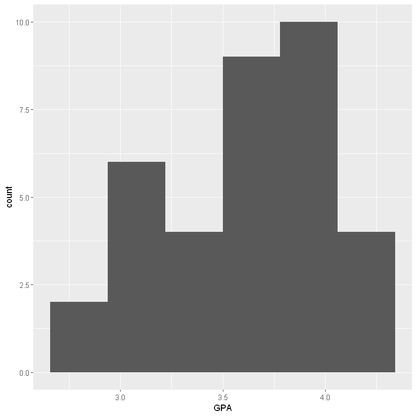

```R
data <- read.csv("D:/JHow/Program/Statistic/elite.csv")
library(ggplot2)
library(dplyr)
library(tidyr)
str(data)
```

    'data.frame':	187 obs. of  21 variables:
     $ gender                        : int  2 2 1 2 1 2 1 1 1 2 ...
     $ grade                         : int  3 3 4 3 4 4 3 3 3 4 ...
     $ school                        : int  1 4 6 2 4 4 2 3 3 2 ...
     $ isCoM                         : int  0 0 0 0 0 0 0 0 0 0 ...
     $ hasMacBook                    : int  1 0 0 1 0 1 0 0 0 1 ...
     $ hasiPhone                     : int  1 1 1 0 0 1 0 0 1 1 ...
     $ hasSuit                       : int  0 1 0 1 0 1 1 0 1 0 ...
     $ timeToDressUp                 : int  45 35 15 5 5 5 25 15 25 15 ...
     $ cafePricePerWeek              : int  150 250 250 50 0 0 150 0 50 150 ...
     $ mealPricePerDay               : int  150 350 350 150 150 150 150 250 250 250 ...
     $ hasCreditCard                 : int  1 1 1 0 0 1 0 0 1 0 ...
     $ hasAttendedBusinessCompetition: int  0 0 0 0 0 0 1 0 1 0 ...
     $ EnglishProficiency            : int  4 4 3 NA 3 5 2 3 2 5 ...
     $ coursesInCoM                  : int  0 2 0 0 0 9 2 1 1 0 ...
     $ coursesInCoMPerYear           : num  0 0.667 0 0 0 ...
     $ GPA                           : num  3.7 3.92 3.2 3.33 4.29 2.4 3.6 3.9 3 3.4 ...
     $ exchangeAbroad                : int  0 1 0 0 0 0 0 0 0 0 ...
     $ numbersOfTravelingAbroad      : num  1.5 1.5 1.5 0 0 1.5 0 0 1.5 1.5 ...
     $ barPerMonth                   : int  0 2 0 0 0 0 0 0 0 0 ...
     $ club                          : int  7 1 3 2 7 7 2 2 5 5 ...
     $ interestInMentionedJob        : int  3 3 2 1 1 5 3 5 5 1 ...
    

## 整體樣本GPa分布


```R
data %>% ggplot(aes(x=GPA)) + geom_histogram(bins = 8)
```


## 管院學生GPa分布


```R
sample <- data %>% filter(school ==7)
sample %>% ggplot(aes(x=GPA)) + geom_histogram(bins = 6)
```





#### 檢驗管院學生GPa是否高於3.73
$H_0 : p \leqslant 3.73\\H_1 : p > 3.73$
<br/><br/>
註:在假設資料接近t分配之下進行檢定
#### p-value


```R
phat <- mean(sample[,"GPA"])
phat
df <- 34
pt((phat-3.73)/sd(sample[,"GPA"])*sqrt(35), df, lower.tail = F)
```


3.61685714285714


0.951830747489718


### 小結
在此，我們將台灣大學的管院平均GPA<br/>
與GPA計算方式與台大相似的史丹佛大學商學院的平均GPA 3.73做比較，<br/>
來檢驗是否台灣大學非管院學生的平均GPA較史丹大學全體來得低。<br/>
而事實上這次的檢驗我們並有極為充足的證據說明台大管院學生的平均GPA低於3.73，<br/>
然而，史丹佛商學院僅提供碩士學位，<br/>因此GPA標準的不同是否能準確比較兩校GPA表現仍需存疑<br/><br/>
資料來源<br/>https://poetsandquants.com/2014/03/27/average-gpas-at-top-50-u-s-business-schools/

## 非管院學生GPa分布


```R
sample <- data %>% filter(school !=7)
sample %>% ggplot(aes(x=GPA)) + geom_histogram(bins = 8)
```


#### 檢驗非管院學生GPa是否低於3.94
$H_0 : p \geqslant 3.94\\H_1 : p < 3.94$
<br/><br/>
註:在假設資料接近t分配之下進行檢定
#### p-value


```R
phat <- mean(sample[,"GPA"])
phat
df <- 34
pt((phat-3.94)/sd(sample[,"GPA"])*sqrt(35), df, lower.tail = T)
```


3.63171052631579


8.37999688360886e-05


### 小結
在此，我們將台灣大學的非管院平均GPA<br/>
與學生人數規模、科系分布且GPA計算方式與台大相似的史丹佛大學的平均GPA 3.94做比較，<br/>
來檢驗是否台灣大學非管院學生的平均GPA較史丹大學全體來得低。<br/>
而事實上這次的檢驗我們並有極為充足的證據說明台大非管院學生的平均GPA低於3.94，
<br/><br/>
資料來源<br/>
https://www.prepscholar.com/sat/s/colleges/Stanford-admission-requirements<br/><br/>
由histogram可見回收的樣本中，<br/>
管院學生成績從B-起跳，非管院則有B-以下的；<br/>
但仔細觀察高分群，A以上的比例其實兩種sample相差不大，都將近七成。<br/>
(所以其他學院的孩子不要在嘴我們GPA高了好嗎 你們也不差呢)<br/>
<br/>
