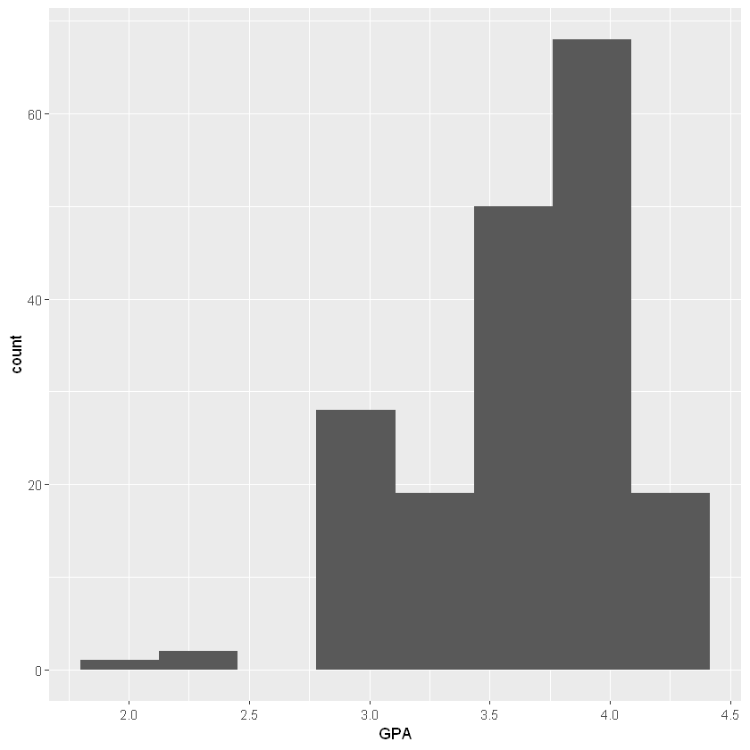

```R
data <- read.csv("D:/JHow/Program/Statistic/elite.csv")
library(ggplot2)
library(dplyr)
library(tidyr)
str(data)
```

    'data.frame':	187 obs. of  21 variables:
     $ gender                        : int  2 2 1 2 1 2 1 1 1 2 ...
     $ grade                         : int  3 3 4 3 4 4 3 3 3 4 ...
     $ school                        : int  1 4 6 2 4 4 2 3 3 2 ...
     $ isCoM                         : int  0 0 0 0 0 0 0 0 0 0 ...
     $ hasMacBook                    : int  1 0 0 1 0 1 0 0 0 1 ...
     $ hasiPhone                     : int  1 1 1 0 0 1 0 0 1 1 ...
     $ hasSuit                       : int  0 1 0 1 0 1 1 0 1 0 ...
     $ timeToDressUp                 : int  45 35 15 5 5 5 25 15 25 15 ...
     $ cafePricePerWeek              : int  150 250 250 50 0 0 150 0 50 150 ...
     $ mealPricePerDay               : Factor w/ 6 levels "150","250","350",..: 1 3 3 1 1 1 1 2 2 2 ...
     $ hasCreditCard                 : int  1 1 1 0 0 1 0 0 1 0 ...
     $ hasAttendedBusinessCompetition: int  0 0 0 0 0 0 1 0 1 0 ...
     $ EnglishProficiency            : int  4 4 3 NA 3 5 2 3 2 5 ...
     $ coursesInCoM                  : int  0 2 0 0 0 9 2 1 1 0 ...
     $ coursesInCoMPerYear           : num  0 0.667 0 0 0 ...
     $ GPA                           : num  3.7 3.92 3.2 3.33 4.29 2.4 3.6 3.9 3 3.4 ...
     $ exchangeAbroad                : int  0 1 0 0 0 0 0 0 0 0 ...
     $ numbersOfTravelingAbroad      : num  1.5 1.5 1.5 0 0 1.5 0 0 1.5 1.5 ...
     $ barPerMonth                   : int  0 2 0 0 0 0 0 0 0 0 ...
     $ club                          : int  7 1 3 2 7 7 2 2 5 5 ...
     $ interestInMentionedJob        : int  3 3 2 1 1 5 3 5 5 1 ...
    

## 整體樣本GPa分布


```R
data %>% ggplot(aes(x=GPA)) + geom_histogram(bins = 8)
```





## 管院學生GPa分布


```R
sample <- data %>% filter(school ==7)
sample %>% ggplot(aes(x=GPA)) + geom_histogram(bins = 6)
```


#### 檢驗管院學生GPa是否高於3.5
$H_0 : p \leqslant 3.5\\H_1 : p > 3.5$
<br/><br/>
註:在假設資料接近t分配之下進行檢定
#### p-value


```R
phat <- mean(sample[,"GPA"])
phat
df <- 34
pt((phat-3.5)/sd(sample[,"GPA"])*sqrt(35), df, lower.tail = F)
```


3.61685714285714


0.0431570042402398


## 非管院學生GPa分布


```R
sample <- data %>% filter(school !=7)
sample %>% ggplot(aes(x=GPA)) + geom_histogram(bins = 8)
```


#### 檢驗管院學生GPa是否高於3.5
$H_0 : p \leqslant 3.5\\H_1 : p > 3.5$
<br/><br/>
註:在假設資料接近t分配之下進行檢定
#### p-value


```R
phat <- mean(sample[,"GPA"])
phat
df <- 34
pt((phat-3.5)/sd(sample[,"GPA"])*sqrt(35), df, lower.tail = F)
```


3.63171052631579


0.0398578776653965

