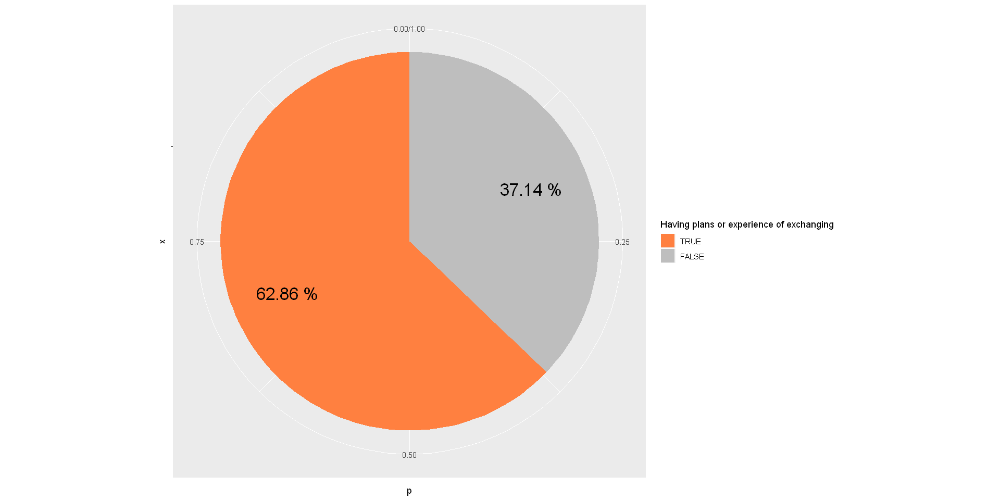
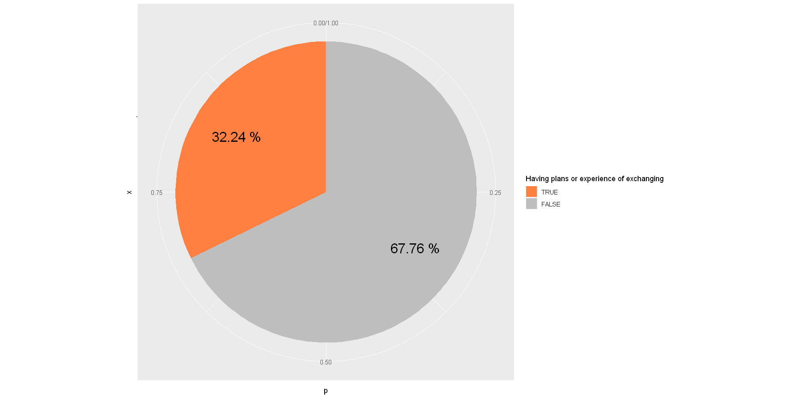
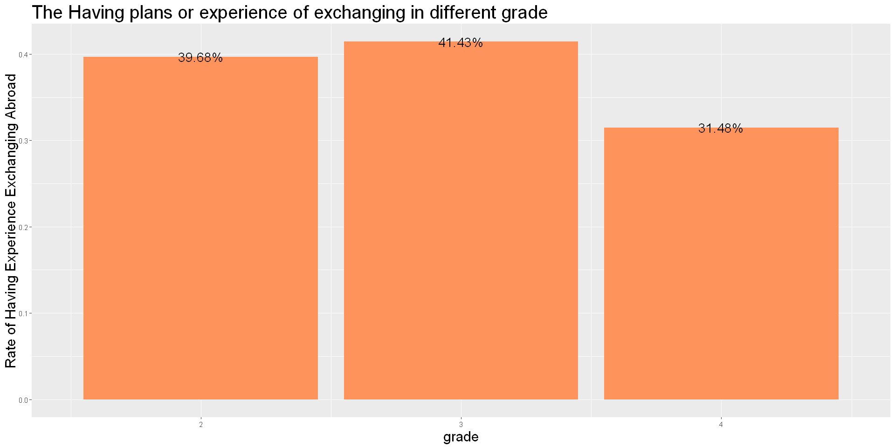

# 參與或規劃出國交換比例


```R
data <- read.csv("D:/JHow/Program/Statistic/elite.csv")
library(ggplot2)
library(dplyr)
library(tidyr)
str(data)
data$exchangeAbroad <- as.logical(data$exchangeAbroad)
observing <- data %>% group_by(exchangeAbroad)
```

    'data.frame':	187 obs. of  21 variables:
     $ gender                        : int  2 2 1 2 1 2 1 1 1 2 ...
     $ grade                         : int  3 3 4 3 4 4 3 3 3 4 ...
     $ school                        : int  1 4 6 2 4 4 2 3 3 2 ...
     $ isCoM                         : int  0 0 0 0 0 0 0 0 0 0 ...
     $ hasMacBook                    : int  1 0 0 1 0 1 0 0 0 1 ...
     $ hasiPhone                     : int  1 1 1 0 0 1 0 0 1 1 ...
     $ hasSuit                       : int  0 1 0 1 0 1 1 0 1 0 ...
     $ timeToDressUp                 : int  45 35 15 5 5 5 25 15 25 15 ...
     $ cafePricePerWeek              : int  150 250 250 50 0 0 150 0 50 150 ...
     $ mealPricePerDay               : int  150 350 350 150 150 150 150 250 250 250 ...
     $ hasCreditCard                 : int  1 1 1 0 0 1 0 0 1 0 ...
     $ hasAttendedBusinessCompetition: int  0 0 0 0 0 0 1 0 1 0 ...
     $ EnglishProficiency            : int  4 4 3 NA 3 5 2 3 2 5 ...
     $ coursesInCoM                  : int  0 2 0 0 0 9 2 1 1 0 ...
     $ coursesInCoMPerYear           : num  0 0.667 0 0 0 ...
     $ GPA                           : num  3.7 3.92 3.2 3.33 4.29 2.4 3.6 3.9 3 3.4 ...
     $ exchangeAbroad                : int  0 1 0 0 0 0 0 0 0 0 ...
     $ numbersOfTravelingAbroad      : num  1.5 1.5 1.5 0 0 1.5 0 0 1.5 1.5 ...
     $ barPerMonth                   : int  0 2 0 0 0 0 0 0 0 0 ...
     $ club                          : int  7 1 3 2 7 7 2 2 5 5 ...
     $ interestInMentionedJob        : int  3 3 2 1 1 5 3 5 5 1 ...
    

## 整體樣本


```R
sample <- observing
options(repr.plot.width=16, repr.plot.height=8)
sample %>% summarise(n = n(), p = n()/ nrow(sample)) %>% mutate(pos = cumsum(p)- p/2) %>% 
    ggplot(aes(x = "", y = p, fill = factor(exchangeAbroad, levels = c(T, F)))) +
    geom_bar(width = 1, stat = "identity") + coord_polar("y", start=0) +
     scale_fill_manual(name = "Having plans or experience of exchanging",
                         values = c("#FF8040", "grey")) +
      geom_text(aes(x= 1.2, y=pos, label = paste(round(p, 4)*100, "%")), size=7)
```


## 管院學生


```R
sample <- observing %>% filter(school == 7)
sample %>% summarise(n = n(), p = n()/ nrow(sample)) %>% mutate(pos = cumsum(p)- p/2) %>% 
    ggplot(aes(x = "", y = p, fill = factor(exchangeAbroad, levels = c(T, F)))) +
    geom_bar(width = 1, stat = "identity") + coord_polar("y", start=0) +
     scale_fill_manual(name = "Having plans or experience of exchanging",
                         values = c("#FF8040", "grey")) +
      geom_text(aes(x= 1.2, y=pos, label = paste(round(p, 4)*100, "%")), size=7)
```





## 非管院學生


```R
sample <- observing %>% filter(school != 7)
sample %>% summarise(n = n(), p = n()/ nrow(sample))  %>% mutate(pos = cumsum(p)- p/2) %>% 
    ggplot(aes(x = "", y = p, fill = factor(exchangeAbroad, levels = c(T, F)))) +
    geom_bar(width = 1, stat = "identity") + coord_polar("y", start=0) +
     scale_fill_manual(name = "Having plans or experience of exchanging",
                         values = c("#FF8040", "grey")) +
      geom_text(aes(x= 1.2, y=pos, label = paste(round(p, 4)*100, "%")), size=7)
```





## 男性


```R
sample <- observing %>% filter(gender == 1)
sample %>% summarise(n = n(), p = n()/ nrow(sample))  %>% mutate(pos = cumsum(p)- p/2) %>% 
    ggplot(aes(x = "", y = p, fill = factor(exchangeAbroad, levels = c(T, F)))) +
    geom_bar(width = 1, stat = "identity") + coord_polar("y", start=0) +
     scale_fill_manual(name = "Having plans or experience of exchanging",
                         values = c("#FF8040", "grey")) +
      geom_text(aes(x= 1.2, y=pos, label = paste(round(p, 4)*100, "%")), size=7)
```


## 女性


```R
sample <- observing %>% filter(gender == 2)
sample %>% summarise(n = n(), p = n()/ nrow(sample))  %>% mutate(pos = cumsum(p)- p/2) %>% 
    ggplot(aes(x = "", y = p, fill = factor(exchangeAbroad, levels = c(T, F)))) +
    geom_bar(width = 1, stat = "identity") + coord_polar("y", start=0) +
     scale_fill_manual(name = "Having plans or experience of exchanging",
                         values = c("#FF8040", "grey")) +
      geom_text(aes(x= 1.2, y=pos, label = paste(round(p, 4)*100, "%")), size=7)
```


## 大二學生


```R
sample <- observing %>% filter(grade == 2)
sample %>% summarise(n = n(), p = n()/ nrow(sample)) %>% mutate(pos = cumsum(p)- p/2) %>% 
    ggplot(aes(x = "", y = p, fill = factor(exchangeAbroad, levels = c(T, F)))) +
    geom_bar(width = 1, stat = "identity") + coord_polar("y", start=0) +
     scale_fill_manual(name = "Having plans or experience of exchanging",
                         values = c("#FF8040", "grey")) +
      geom_text(aes(x= 1.2, y=pos, label = paste(round(p, 4)*100, "%")), size=7)
```


## 大三學生


```R
sample <- observing %>% filter(grade == 3)
sample %>% summarise(n = n(), p = n()/ nrow(sample)) %>% mutate(pos = cumsum(p)- p/2) %>% 
    ggplot(aes(x = "", y = p, fill = factor(exchangeAbroad, levels = c(T, F)))) +
    geom_bar(width = 1, stat = "identity") + coord_polar("y", start=0) +
     scale_fill_manual(name = "Having plans or experience of exchanging",
                         values = c("#FF8040", "grey")) +
      geom_text(aes(x= 1.2, y=pos, label = paste(round(p, 4)*100, "%")), size=7)
```


## 大四學生


```R
sample <- observing %>% filter(grade == 4)
sample %>% summarise(n = n(), p = n()/ nrow(sample)) %>% mutate(pos = cumsum(p)- p/2) %>% 
    ggplot(aes(x = "", y = p, fill = factor(exchangeAbroad, levels = c(T, F)))) +
    geom_bar(width = 1, stat = "identity") + coord_polar("y", start=0) +
     scale_fill_manual(name = "Having plans or experience of exchanging",
                         values = c("#FF8040", "grey")) +
      geom_text(aes(x= 1.2, y=pos, label = paste(round(p, 4)*100, "%")), size=7)
```


## 按年級比較


```R
options(repr.plot.width=16, repr.plot.height=8)
observing %>% group_by(grade) %>% summarise(exchangeAbroad = sum(exchangeAbroad) ,total = n()) %>% mutate(p = exchangeAbroad / total) %>%
    ggplot(aes(x = grade, y = p)) + geom_col(fill = "#FF935C") +
    geom_text(aes( label = scales::percent(p),
                   y= p ), stat= "identity", position = position_dodge(1), size = 6) +
    labs(x = "grade", y = "Rate of Having Experience Exchanging Abroad", title = "The Having plans or experience of exchanging in different grade") +
    theme(plot.title = element_text(size = 24),
          axis.title = element_text(size = 18))
```





## 按學院比較


```R
options(repr.plot.width=16, repr.plot.height=8)

ob2 <- observing
ob2$school[ob2$school == 1] = "文學院"
ob2$school[ob2$school == 2] = "理學院"
ob2$school[ob2$school == 3] = "社科院"
ob2$school[ob2$school == 4] = "醫學院"
ob2$school[ob2$school == 5] = "工學院"
ob2$school[ob2$school == 6] = "生農學院"
ob2$school[ob2$school == 7] = "管理學院"
ob2$school[ob2$school == 8] = "公衛學院"
ob2$school[ob2$school == 9] = "電資學院"
ob2$school[ob2$school == 10] = "法律學院"
ob2$school[ob2$school == 11] = "生科院"
ob2  %>% group_by(school) %>% summarise(exchangeAbroad = sum(exchangeAbroad) ,total = n()) %>% mutate(p = exchangeAbroad / total) %>%
    ggplot(aes(x = factor(school), y = p)) + geom_col(fill = "#FF935C") +
    geom_text(aes( label = scales::percent(p),
                   y= p ), stat= "identity", position = position_dodge(1), size = 6) +
    labs(x = "school", y = "Rate of Having Experience Exchanging Abroad", title = "The Having plans or experience of exchanging in different school") +
    theme(plot.title = element_text(size = 24),
          axis.title = element_text(size = 18))
```


# 非管院學生參與或規劃出國交換 之信賴區間


```R
sample <- observing %>% filter(school != 7)
ptable <- sample %>% summarise(n = n(), p = n()/ nrow(sample))
```

#### 檢查 $np$  和 $n(1-p)$ 大於 5


```R
phat <- as.numeric(ptable[2, "p"])
paste("np =", phat * nrow(sample))
paste("n(1-p) =", (1-phat) * nrow(sample))
```


'np = 49'


'n(1-p) = 103'


```R
alpha <- 0.05
UCL <- phat + qnorm(alpha/2, lower.tail = F) * sqrt(phat * (1-phat)/nrow(sample))
LCL <- phat - qnorm(alpha/2, lower.tail = F) * sqrt(phat * (1-phat)/nrow(sample))
paste0("[ ", round(LCL,4) * 100, "%, ", round(UCL,4) * 100, "% ]")
```


'[ 24.81%, 39.67% ]'


#### 檢驗非管院學生參與或規劃出國交換比例是否低於0.4
$H_0 : p \geqslant 0.4\\H_1 : p < 0.4$


#### p-value are


```R
p0 <- 0.4
z <- (phat - p0)/sqrt(p0*(1-p0)/nrow(sample))
pnorm(z, lower.tail = T)
```


0.0253692272447111


# 管院學生參與或規劃出國交換 之信賴區間


```R
sample <- observing %>% filter(school == 7)
ptable <- sample %>% summarise(n = n(), p = n()/ nrow(sample))
```

#### Check if $np$ and $n(1-p)$ larger than 5


```R
phat <- as.numeric(ptable[2, "p"])
paste("np =", phat * nrow(sample))
paste("n(1-p) =", (1-phat) * nrow(sample))
```


'np = 22'


'n(1-p) = 13'


#### 計算在95%信心水準下的的信賴區間


```R
alpha <- 0.05
UCL <- phat + qnorm(alpha/2, lower.tail = F) * sqrt(phat * (1-phat)/nrow(sample))
LCL <- phat - qnorm(alpha/2, lower.tail = F) * sqrt(phat * (1-phat)/nrow(sample))
paste0("[ ", round(LCL,4) * 100, "%, ", round(UCL,4) * 100, "% ]")
```


'[ 46.85%, 78.86% ]'


#### 檢驗管院學生參加企業競賽比例是否高於0.4
$H_0 : p \leqslant 0.4\\H_1 : p > 0.4$


#### p-value are


```R
p0 <- 0.4
z <- (phat - p0)/sqrt(p0*(1-p0)/nrow(sample))
pnorm(z, lower.tail = F)
```


0.00288774904465261


整體台大學生中，有交換經驗或規劃比例約為四成，非管院學生只有約32.24%，而管院學生則高達62.86%。可見交換這個項目有較多管院學生感興趣及參與。

以台大整體來說，女生有交換經驗或規劃的比例（48.91%）多男生約20個百分點。

大三時有較多人有交換的經驗或規劃，大四時的比例驟降，猜測是同學們有其他人生規劃（就業，考研，準備國考等）。

在95%的信心水準下，我們發現非管院學生曾有交換規劃的比例介於[24.81%,39.67%]之間

在95%的信心水準下，管院學生曾有交換規劃的比例介於[46.85%,78.86%]之間。
