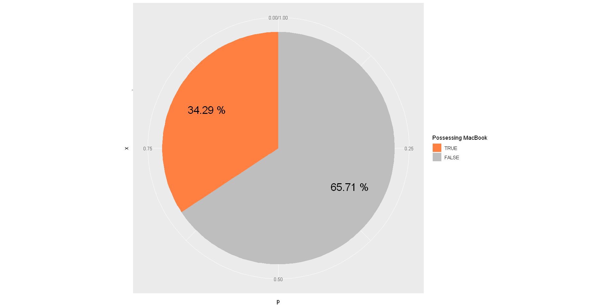
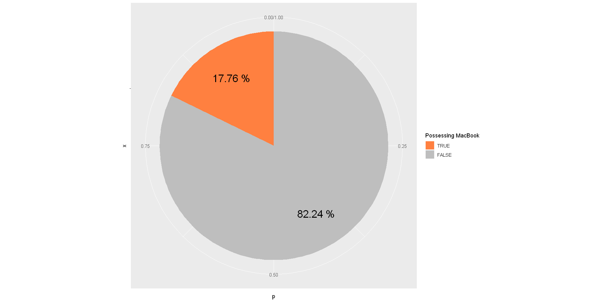
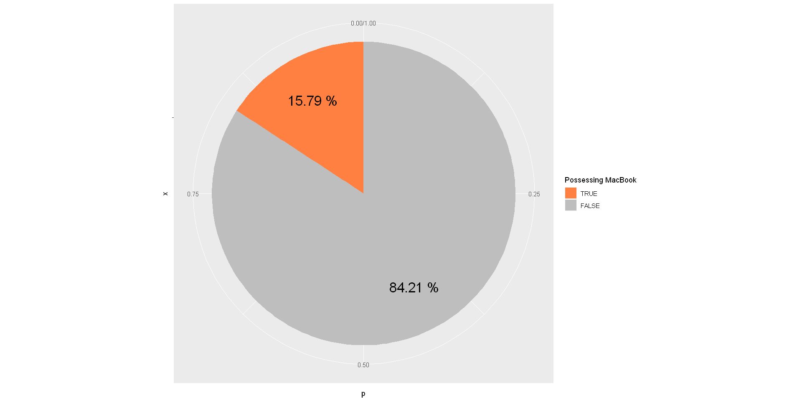
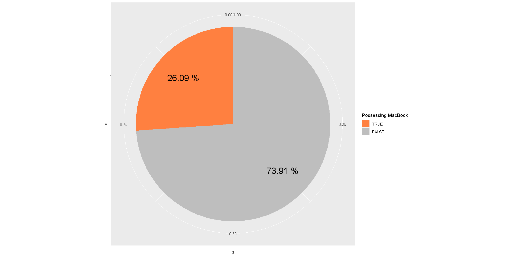
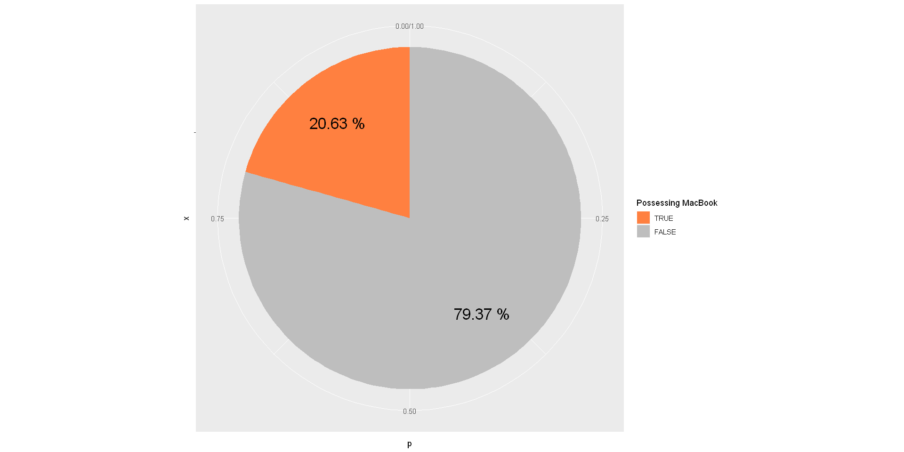
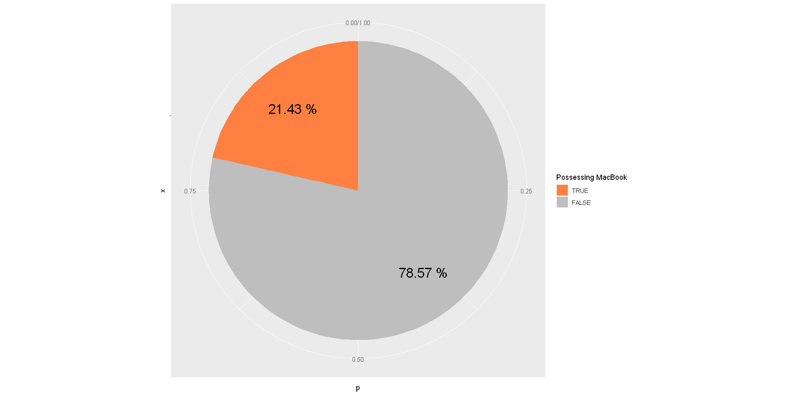
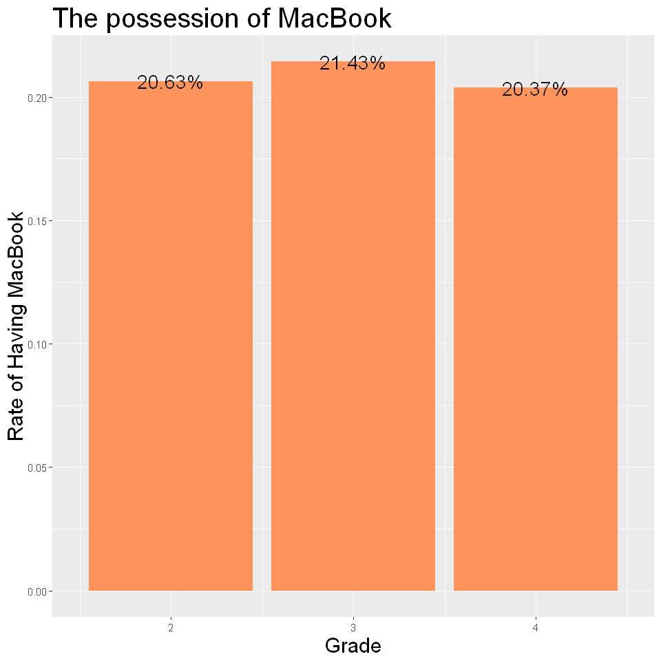
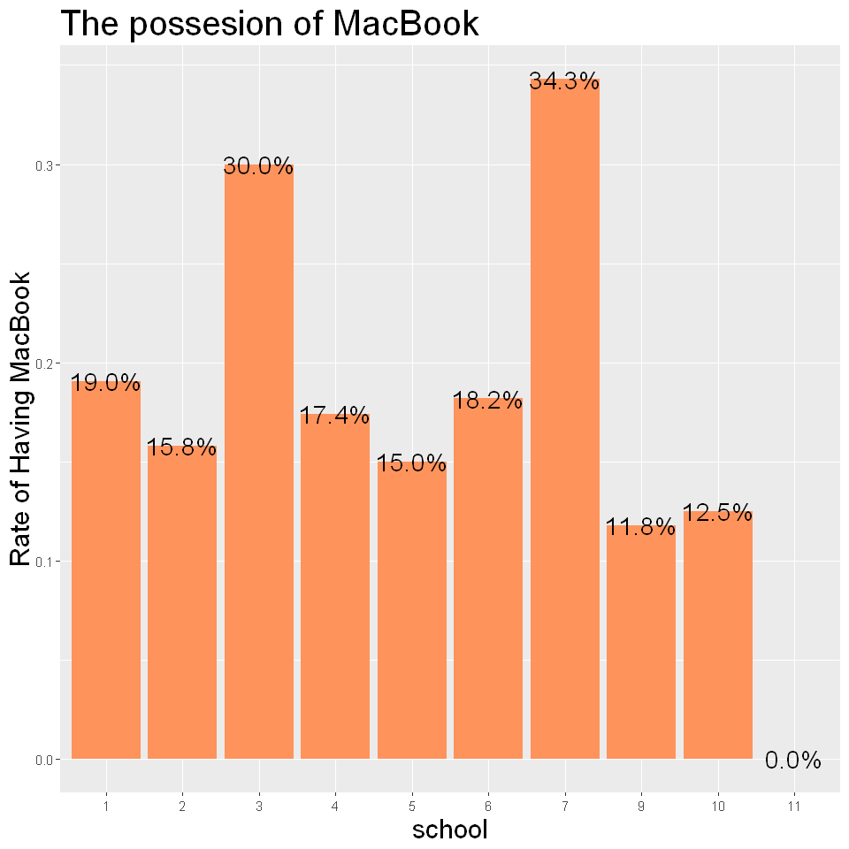

# 持有MacBook比例


```R
data <- read.csv("D:/JHow/Program/Statistic/elite.csv")
library(ggplot2)
library(dplyr)
library(tidyr)
str(data)
data$hasMacBook <- as.logical(data$hasMacBook)
observing <- data %>% group_by(hasMacBook)
```

    'data.frame':	187 obs. of  21 variables:
     $ gender                        : int  2 2 1 2 1 2 1 1 1 2 ...
     $ grade                         : int  3 3 4 3 4 4 3 3 3 4 ...
     $ school                        : int  1 4 6 2 4 4 2 3 3 2 ...
     $ isCoM                         : int  0 0 0 0 0 0 0 0 0 0 ...
     $ hasMacBook                    : int  1 0 0 1 0 1 0 0 0 1 ...
     $ hasiPhone                     : int  1 1 1 0 0 1 0 0 1 1 ...
     $ hasSuit                       : int  0 1 0 1 0 1 1 0 1 0 ...
     $ timeToDressUp                 : int  45 35 15 5 5 5 25 15 25 15 ...
     $ cafePricePerWeek              : int  150 250 250 50 0 0 150 0 50 150 ...
     $ mealPricePerDay               : Factor w/ 6 levels "150","250","350",..: 1 3 3 1 1 1 1 2 2 2 ...
     $ hasCreditCard                 : int  1 1 1 0 0 1 0 0 1 0 ...
     $ hasAttendedBusinessCompetition: int  0 0 0 0 0 0 1 0 1 0 ...
     $ EnglishProficiency            : int  4 4 3 NA 3 5 2 3 2 5 ...
     $ coursesInCoM                  : int  0 2 0 0 0 9 2 1 1 0 ...
     $ coursesInCoMPerYear           : num  0 0.667 0 0 0 ...
     $ GPA                           : num  3.7 3.92 3.2 3.33 4.29 2.4 3.6 3.9 3 3.4 ...
     $ exchangeAbroad                : int  0 1 0 0 0 0 0 0 0 0 ...
     $ numbersOfTravelingAbroad      : num  1.5 1.5 1.5 0 0 1.5 0 0 1.5 1.5 ...
     $ barPerMonth                   : int  0 2 0 0 0 0 0 0 0 0 ...
     $ club                          : int  7 1 3 2 7 7 2 2 5 5 ...
     $ interestInMentionedJob        : int  3 3 2 1 1 5 3 5 5 1 ...
    

## 整體樣本


```R
sample <- observing
options(repr.plot.width=16, repr.plot.height=8)
sample %>% summarise(n = n(), p = n()/ nrow(sample)) %>% mutate(pos = cumsum(p)- p/2) %>% 
    ggplot(aes(x = "", y = p, fill = factor(hasMacBook, levels = c(T, F)))) +
    geom_bar(width = 1, stat = "identity") + coord_polar("y", start=0) +
     scale_fill_manual(name = "Possessing MacBook",
                         values = c("#FF8040", "grey")) +
      geom_text(aes(x= 1.2, y=pos, label = paste(round(p, 4)*100, "%")), size=7)
```


## 管院學生


```R
sample <- observing %>% filter(school == 7)
sample %>% summarise(n = n(), p = n()/ nrow(sample)) %>% mutate(pos = cumsum(p)- p/2) %>% 
    ggplot(aes(x = "", y = p, fill = factor(hasMacBook, levels = c(T, F)))) +
    geom_bar(width = 1, stat = "identity") + coord_polar("y", start=0) +
     scale_fill_manual(name = "Possessing MacBook",
                         values = c("#FF8040", "grey")) +
      geom_text(aes(x= 1.2, y=pos, label = paste(round(p, 4)*100, "%")), size=7)
```





## 非管院學生


```R
sample <- observing %>% filter(school != 7)
sample %>% summarise(n = n(), p = n()/ nrow(sample))  %>% mutate(pos = cumsum(p)- p/2) %>% 
    ggplot(aes(x = "", y = p, fill = factor(hasMacBook, levels = c(T, F)))) +
    geom_bar(width = 1, stat = "identity") + coord_polar("y", start=0) +
     scale_fill_manual(name = "Possessing MacBook",
                         values = c("#FF8040", "grey")) +
      geom_text(aes(x= 1.2, y=pos, label = paste(round(p, 4)*100, "%")), size=7)
```





```R
管院學生使用macbook比例遠高於非管院的比例（在我們的樣本裡幾乎是兩倍！），這個刻板印象也是來之有據。
```

## 男性


```R
sample <- observing %>% filter(gender == 1)
sample %>% summarise(n = n(), p = n()/ nrow(sample))  %>% mutate(pos = cumsum(p)- p/2) %>% 
    ggplot(aes(x = "", y = p, fill = factor(hasMacBook, levels = c(T, F)))) +
    geom_bar(width = 1, stat = "identity") + coord_polar("y", start=0) +
     scale_fill_manual(name = "Possessing MacBook",
                         values = c("#FF8040", "grey")) +
      geom_text(aes(x= 1.2, y=pos, label = paste(round(p, 4)*100, "%")), size=7)
```





## 女性


```R
sample <- observing %>% filter(gender == 2)
sample %>% summarise(n = n(), p = n()/ nrow(sample))  %>% mutate(pos = cumsum(p)- p/2) %>% 
    ggplot(aes(x = "", y = p, fill = factor(hasMacBook, levels = c(T, F)))) +
    geom_bar(width = 1, stat = "identity") + coord_polar("y", start=0) +
     scale_fill_manual(name = "Possessing MacBook",
                         values = c("#FF8040", "grey")) +
      geom_text(aes(x= 1.2, y=pos, label = paste(round(p, 4)*100, "%")), size=7)
```





```R
以台大整體來說，男生使用macbook的比例遠低於女生。
```

## 大二學生


```R
sample <- observing %>% filter(grade == 2)
sample %>% summarise(n = n(), p = n()/ nrow(sample)) %>% mutate(pos = cumsum(p)- p/2) %>% 
    ggplot(aes(x = "", y = p, fill = factor(hasMacBook, levels = c(T, F)))) +
    geom_bar(width = 1, stat = "identity") + coord_polar("y", start=0) +
     scale_fill_manual(name = "Possessing MacBook",
                         values = c("#FF8040", "grey")) +
      geom_text(aes(x= 1.2, y=pos, label = paste(round(p, 4)*100, "%")), size=7)
```





## 大三學生


```R
sample <- observing %>% filter(grade == 3)
sample %>% summarise(n = n(), p = n()/ nrow(sample)) %>% mutate(pos = cumsum(p)- p/2) %>% 
    ggplot(aes(x = "", y = p, fill = factor(hasMacBook, levels = c(T, F)))) +
    geom_bar(width = 1, stat = "identity") + coord_polar("y", start=0) +
     scale_fill_manual(name = "Possessing MacBook",
                         values = c("#FF8040", "grey")) +
      geom_text(aes(x= 1.2, y=pos, label = paste(round(p, 4)*100, "%")), size=7)
```





## 大四學生


```R
sample <- observing %>% filter(grade == 4)
sample %>% summarise(n = n(), p = n()/ nrow(sample)) %>% mutate(pos = cumsum(p)- p/2) %>% 
    ggplot(aes(x = "", y = p, fill = factor(hasMacBook, levels = c(T, F)))) +
    geom_bar(width = 1, stat = "identity") + coord_polar("y", start=0) +
     scale_fill_manual(name = "Possessing MacBook",
                         values = c("#FF8040", "grey")) +
      geom_text(aes(x= 1.2, y=pos, label = paste(round(p, 4)*100, "%")), size=7)
```


## 按年級比較


```R
options(repr.plot.width=8, repr.plot.height=8)
observing %>% group_by(grade) %>% summarise(hasMacBook = sum(hasMacBook) ,total = n()) %>% mutate(p = hasMacBook / total) %>%
    ggplot(aes(x = grade, y = p)) + geom_col(fill = "#FF935C") +
    geom_text(aes( label = scales::percent(p),
                   y= p ), stat= "identity", position = position_dodge(1), size = 6) +
    labs(x = "Grade", y = "Rate of Having MacBook", title = "The possession of MacBook") +
    theme(plot.title = element_text(size = 24),
          axis.title = element_text(size = 18))
```





```R
我們無法從此「年級與『使用macbook比例』」長條圖，判斷出大概的趨勢。
```

## 按學院比較


```R
options(repr.plot.width=8, repr.plot.height=8)
observing %>% group_by(school) %>% summarise(hasMacBook = sum(hasMacBook) ,total = n()) %>% mutate(p = hasMacBook / total) %>%
    ggplot(aes(x = factor(school), y = p)) + geom_col(fill = "#FF935C") +
    geom_text(aes( label = scales::percent(p),
                   y= p ), stat= "identity", position = position_dodge(1), size = 6) +
    labs(x = "school", y = "Rate of Having MacBook", title = "The possesion of MacBook") +
    theme(plot.title = element_text(size = 24),
          axis.title = element_text(size = 18))
```





# 非管院學生持有MacBook 之信賴區間


```R
sample <- observing %>% filter(school != 7)
ptable <- sample %>% summarise(n = n(), p = n()/ nrow(sample))
```

#### 檢查 $np$  和 $n(1-p)$ 大於 5


```R
phat <- as.numeric(ptable[2, "p"])
paste("np =", phat * nrow(sample))
paste("n(1-p) =", (1-phat) * nrow(sample))
```


'np = 27'


'n(1-p) = 125'


```R
alpha <- 0.05
UCL <- phat + qnorm(alpha/2, lower.tail = F) * sqrt(phat * (1-phat)/nrow(sample))
LCL <- phat - qnorm(alpha/2, lower.tail = F) * sqrt(phat * (1-phat)/nrow(sample))
paste0("[ ", round(LCL,4) * 100, "%, ", round(UCL,4) * 100, "% ]")
```


'[ 11.69%, 23.84% ]'


#### 檢驗非管院學生持有MacBook比例是否低於0.25
$H_0 : p \geqslant 0.25\\H_1 : p < 0.25$


#### p-value are


```R
p0 <- 0.25
z <- (phat - p0)/sqrt(p0*(1-p0)/nrow(sample))
pnorm(z, lower.tail = T)
```


0.0196759184306718


# 管院學生持有MacBook 之信賴區間


```R
sample <- observing %>% filter(school == 7)
ptable <- sample %>% summarise(n = n(), p = n()/ nrow(sample))
```

#### Check if $np$ and $n(1-p)$ larger than 5


```R
phat <- as.numeric(ptable[2, "p"])
paste("np =", phat * nrow(sample))
paste("n(1-p) =", (1-phat) * nrow(sample))
```


'np = 12'


'n(1-p) = 23'


#### 計算在95%信心水準下的的信賴區間


```R
alpha <- 0.05
UCL <- phat + qnorm(alpha/2, lower.tail = F) * sqrt(phat * (1-phat)/nrow(sample))
LCL <- phat - qnorm(alpha/2, lower.tail = F) * sqrt(phat * (1-phat)/nrow(sample))
paste0("[ ", round(LCL,4) * 100, "%, ", round(UCL,4) * 100, "% ]")
```


'[ 18.56%, 50.01% ]'


#### 檢驗管院學生參加企業競賽比例是否高於0.25
$H_0 : p \leqslant 0.25\\H_1 : p > 0.25$


#### p-value are


```R
p0 <- 0.25
z <- (phat - p0)/sqrt(p0*(1-p0)/nrow(sample))
pnorm(z, lower.tail = F)
```


0.102279376360276


管院學生使用macbook比例（34.29%）遠高於非管院的比例（17.76%），在我們的樣本裡幾乎是兩倍！這個刻板印象也是來之有據。

以台大整體來說，男生使用macbook的比例遠低於女生。

＠＠＠從我們的樣本裡可以看出，女生在使用iphone, macbook的比例上都叫男生高，可猜測女生較偏好Apple.Inc的產品。

我們無法從此「年級與『使用macbook比例』」長條圖，判斷出使用MacBook的大概的趨勢。

在95%的信心水準下，我們發現非管院學生使用MacBook的比例介於[11.69%,23.84%]之間

在95%的信心水準下，管院學生使用MacBook的比例介於[18.56%,50.01%]之間。
