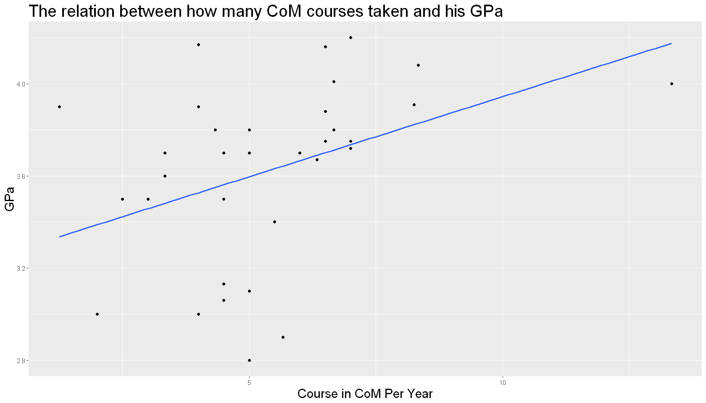

```R
data <- read.csv("D:/JHow/Program/Statistic/elite.csv")
library(ggplot2)
library(dplyr)
library(tidyr)
str(data)
```

    'data.frame':	187 obs. of  21 variables:
     $ gender                        : int  2 2 1 2 1 2 1 1 1 2 ...
     $ grade                         : int  3 3 4 3 4 4 3 3 3 4 ...
     $ school                        : int  1 4 6 2 4 4 2 3 3 2 ...
     $ isCoM                         : int  0 0 0 0 0 0 0 0 0 0 ...
     $ hasMacBook                    : int  1 0 0 1 0 1 0 0 0 1 ...
     $ hasiPhone                     : int  1 1 1 0 0 1 0 0 1 1 ...
     $ hasSuit                       : int  0 1 0 1 0 1 1 0 1 0 ...
     $ timeToDressUp                 : int  45 35 15 5 5 5 25 15 25 15 ...
     $ cafePricePerWeek              : int  150 250 250 50 0 0 150 0 50 150 ...
     $ mealPricePerDay               : Factor w/ 6 levels "150","250","350",..: 1 3 3 1 1 1 1 2 2 2 ...
     $ hasCreditCard                 : int  1 1 1 0 0 1 0 0 1 0 ...
     $ hasAttendedBusinessCompetition: int  0 0 0 0 0 0 1 0 1 0 ...
     $ EnglishProficiency            : int  4 4 3 NA 3 5 2 3 2 5 ...
     $ coursesInCoM                  : int  0 2 0 0 0 9 2 1 1 0 ...
     $ coursesInCoMPerYear           : num  0 0.667 0 0 0 ...
     $ GPA                           : num  3.7 3.92 3.2 3.33 4.29 2.4 3.6 3.9 3 3.4 ...
     $ exchangeAbroad                : int  0 1 0 0 0 0 0 0 0 0 ...
     $ numbersOfTravelingAbroad      : num  1.5 1.5 1.5 0 0 1.5 0 0 1.5 1.5 ...
     $ barPerMonth                   : int  0 2 0 0 0 0 0 0 0 0 ...
     $ club                          : int  7 1 3 2 7 7 2 2 5 5 ...
     $ interestInMentionedJob        : int  3 3 2 1 1 5 3 5 5 1 ...
    

## 9. 繪製管院課程數量與GPA的散佈圖(註:資料分布非線性)


```R
options(repr.plot.width=14, repr.plot.height=8)
data %>% ggplot(aes(y = GPA, x = coursesInCoMPerYear)) + geom_point() +
    geom_smooth(method = 'lm', se = F, fullrange = T) +
    labs(x = "Course in CoM Per Year", y = "GPa", title = "The relation between how many CoM courses taken and his GPa") +
    theme(plot.title = element_text(size = 24),
          axis.title = element_text(size = 18))
```


#### 相關係數


```R
cor(data$GPA, data$coursesInCoMPerYear)
```


0.0210602106281308


### 只考慮有修過一門以上管院課程的人(參考性低)


```R
sample <- data %>% filter(coursesInCoMPerYear > 0)
sample %>% ggplot(aes(y = GPA, x = coursesInCoMPerYear)) + geom_point() +
    geom_smooth(method = 'lm', se = F, fullrange = T) +
    labs(x = "Course in CoM Per Year", y = "GPa", title = "The relation between how many CoM courses taken and his GPa") +
    theme(plot.title = element_text(size = 24),
          axis.title = element_text(size = 18))
```


```R
cor(sample$GPA, sample$coursesInCoMPerYear)
```


0.123170012562573


#### 此樣本性別分布


```R
sample %>% group_by(gender) %>% summarise(n=n()) %>% mutate(p = n / nrow(sample))
```


<table>
<caption>A tibble: 2 × 3</caption>
<thead>
	<tr><th scope=col>gender</th><th scope=col>n</th><th scope=col>p</th></tr>
	<tr><th scope=col>&lt;int&gt;</th><th scope=col>&lt;int&gt;</th><th scope=col>&lt;dbl&gt;</th></tr>
</thead>
<tbody>
	<tr><td>1</td><td>33</td><td>0.4852941</td></tr>
	<tr><td>2</td><td>35</td><td>0.5147059</td></tr>
</tbody>
</table>


#### 此樣本學院分布


```R
sample %>% group_by(school) %>% summarise(n=n()) %>% mutate(p = n / nrow(sample))
```


<table>
<caption>A tibble: 9 × 3</caption>
<thead>
	<tr><th scope=col>school</th><th scope=col>n</th><th scope=col>p</th></tr>
	<tr><th scope=col>&lt;int&gt;</th><th scope=col>&lt;int&gt;</th><th scope=col>&lt;dbl&gt;</th></tr>
</thead>
<tbody>
	<tr><td> 1</td><td> 7</td><td>0.10294118</td></tr>
	<tr><td> 2</td><td> 2</td><td>0.02941176</td></tr>
	<tr><td> 3</td><td> 6</td><td>0.08823529</td></tr>
	<tr><td> 4</td><td> 5</td><td>0.07352941</td></tr>
	<tr><td> 5</td><td> 5</td><td>0.07352941</td></tr>
	<tr><td> 6</td><td> 3</td><td>0.04411765</td></tr>
	<tr><td> 7</td><td>35</td><td>0.51470588</td></tr>
	<tr><td> 9</td><td> 4</td><td>0.05882353</td></tr>
	<tr><td>10</td><td> 1</td><td>0.01470588</td></tr>
</tbody>
</table>


#### 此樣本年級分布


```R
sample %>% group_by(grade) %>% summarise(n=n()) %>% mutate(p = n / nrow(sample))
```


<table>
<caption>A tibble: 3 × 3</caption>
<thead>
	<tr><th scope=col>grade</th><th scope=col>n</th><th scope=col>p</th></tr>
	<tr><th scope=col>&lt;int&gt;</th><th scope=col>&lt;int&gt;</th><th scope=col>&lt;dbl&gt;</th></tr>
</thead>
<tbody>
	<tr><td>2</td><td>24</td><td>0.3529412</td></tr>
	<tr><td>3</td><td>24</td><td>0.3529412</td></tr>
	<tr><td>4</td><td>20</td><td>0.2941176</td></tr>
</tbody>
</table>


### 考慮非管院學生


```R
sample <- data %>% filter(school != 7) %>% filter(coursesInCoMPerYear > 0)
sample %>% ggplot(aes(y = GPA, x = coursesInCoMPerYear)) + geom_point() +
    geom_smooth(method = 'lm', se = F, fullrange = T) +
    labs(x = "Course in CoM Per Year", y = "GPa", title = "The relation between how many CoM courses taken and his GPa") +
    theme(plot.title = element_text(size = 24),
          axis.title = element_text(size = 18))
```


#### 相關係數


```R
cor(sample$GPA, sample$coursesInCoMPerYear)
```


-0.263340484195039


#### 此樣本性別分布


```R
sample %>% group_by(gender) %>% summarise(n=n()) %>% mutate(p = n / nrow(sample))
```


<table>
<caption>A tibble: 2 × 3</caption>
<thead>
	<tr><th scope=col>gender</th><th scope=col>n</th><th scope=col>p</th></tr>
	<tr><th scope=col>&lt;int&gt;</th><th scope=col>&lt;int&gt;</th><th scope=col>&lt;dbl&gt;</th></tr>
</thead>
<tbody>
	<tr><td>1</td><td>19</td><td>0.5757576</td></tr>
	<tr><td>2</td><td>14</td><td>0.4242424</td></tr>
</tbody>
</table>


#### 此樣本學院分布


```R
sample %>% group_by(school) %>% summarise(n=n()) %>% mutate(p = n / nrow(sample))
```


<table>
<caption>A tibble: 8 × 3</caption>
<thead>
	<tr><th scope=col>school</th><th scope=col>n</th><th scope=col>p</th></tr>
	<tr><th scope=col>&lt;int&gt;</th><th scope=col>&lt;int&gt;</th><th scope=col>&lt;dbl&gt;</th></tr>
</thead>
<tbody>
	<tr><td> 1</td><td>7</td><td>0.21212121</td></tr>
	<tr><td> 2</td><td>2</td><td>0.06060606</td></tr>
	<tr><td> 3</td><td>6</td><td>0.18181818</td></tr>
	<tr><td> 4</td><td>5</td><td>0.15151515</td></tr>
	<tr><td> 5</td><td>5</td><td>0.15151515</td></tr>
	<tr><td> 6</td><td>3</td><td>0.09090909</td></tr>
	<tr><td> 9</td><td>4</td><td>0.12121212</td></tr>
	<tr><td>10</td><td>1</td><td>0.03030303</td></tr>
</tbody>
</table>


#### 此樣本年級分布


```R
sample %>% group_by(grade) %>% summarise(n=n()) %>% mutate(p = n / nrow(sample))
```


<table>
<caption>A tibble: 3 × 3</caption>
<thead>
	<tr><th scope=col>grade</th><th scope=col>n</th><th scope=col>p</th></tr>
	<tr><th scope=col>&lt;int&gt;</th><th scope=col>&lt;int&gt;</th><th scope=col>&lt;dbl&gt;</th></tr>
</thead>
<tbody>
	<tr><td>2</td><td>12</td><td>0.3636364</td></tr>
	<tr><td>3</td><td> 8</td><td>0.2424242</td></tr>
	<tr><td>4</td><td>13</td><td>0.3939394</td></tr>
</tbody>
</table>


### 只考慮管院學生


```R
sample <- data %>% filter(school == 7)
sample %>% ggplot(aes(y = GPA, x = coursesInCoMPerYear)) + geom_point() +
    geom_smooth(method = 'lm', se = F, fullrange = T) +
    labs(x = "Course in CoM Per Year", y = "GPa", title = "The relation between how many CoM courses taken and his GPa") +
    theme(plot.title = element_text(size = 24),
          axis.title = element_text(size = 18))
```





#### 相關係數


```R
cor(sample$GPA, sample$coursesInCoMPerYear)
```


0.385924552949451


#### 此樣本性別分布


```R
sample %>% group_by(gender) %>% summarise(n=n()) %>% mutate(p = n / nrow(sample))
```


<table>
<caption>A tibble: 2 × 3</caption>
<thead>
	<tr><th scope=col>gender</th><th scope=col>n</th><th scope=col>p</th></tr>
	<tr><th scope=col>&lt;int&gt;</th><th scope=col>&lt;int&gt;</th><th scope=col>&lt;dbl&gt;</th></tr>
</thead>
<tbody>
	<tr><td>1</td><td>14</td><td>0.4</td></tr>
	<tr><td>2</td><td>21</td><td>0.6</td></tr>
</tbody>
</table>


#### 此樣本學院分布


```R
sample %>% group_by(school) %>% summarise(n=n()) %>% mutate(p = n / nrow(sample))
```


<table>
<caption>A tibble: 1 × 3</caption>
<thead>
	<tr><th scope=col>school</th><th scope=col>n</th><th scope=col>p</th></tr>
	<tr><th scope=col>&lt;int&gt;</th><th scope=col>&lt;int&gt;</th><th scope=col>&lt;dbl&gt;</th></tr>
</thead>
<tbody>
	<tr><td>7</td><td>35</td><td>1</td></tr>
</tbody>
</table>


#### 此樣本年級分布


```R
sample %>% group_by(grade) %>% summarise(n=n()) %>% mutate(p = n / nrow(sample))
```


<table>
<caption>A tibble: 3 × 3</caption>
<thead>
	<tr><th scope=col>grade</th><th scope=col>n</th><th scope=col>p</th></tr>
	<tr><th scope=col>&lt;int&gt;</th><th scope=col>&lt;int&gt;</th><th scope=col>&lt;dbl&gt;</th></tr>
</thead>
<tbody>
	<tr><td>2</td><td>12</td><td>0.3428571</td></tr>
	<tr><td>3</td><td>16</td><td>0.4571429</td></tr>
	<tr><td>4</td><td> 7</td><td>0.2000000</td></tr>
</tbody>
</table>


